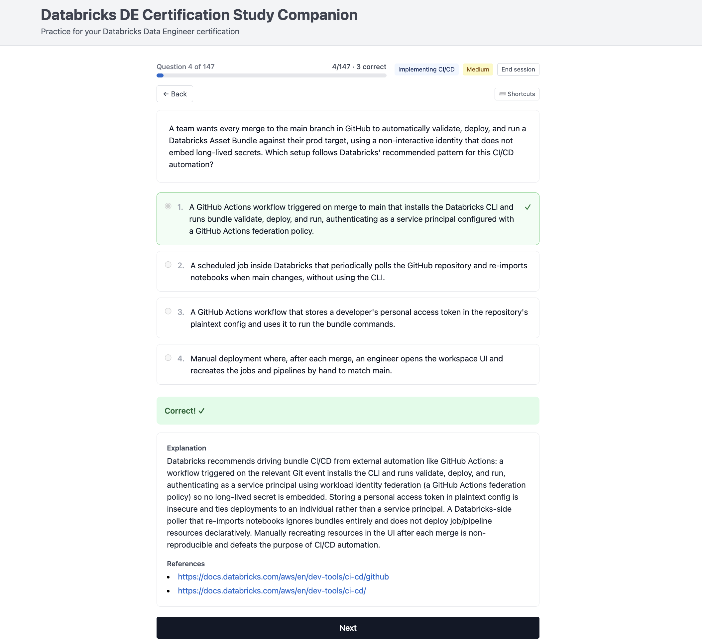

# Databricks Data Engineer Certification Study Companion

A local practice application to help you prepare for the Databricks Data Engineer **Associate** and **Professional** certification exams.
Please note that questions used in this app are AI-generated and might not be up to date, so they might contain mistakes or be factually wrong. Always review the official documentation. You are welcome to contribute if your notice any errors or inaccuracies.



## Overview

The app provides two types of practice exercises, both grounded in the official exam blueprints and Databricks documentation:

1. **Multiple Choice Questions (MCQ)** — Blueprint-aligned, single-select questions across every exam domain. Each question is an *Option Pool* (one correct answer plus several distractors); options are sampled and shuffled each time so the same question never replays identically.
2. **Code-Completion Exercises** — Wordle-style, fill-in-the-blank syntax drills for SQL and PySpark with per-character feedback and a bounded number of guesses.

Beyond plain practice, the app tracks your progress and helps you study efficiently:

- **Generate new questions with the /write-mcq skill**
- **Domain + exam filtering** and exercise-type selection when starting a session
- **Unseen-first ordering** — questions you haven't answered yet are served before ones you've already seen
- **Stats dashboard & readiness indicator** — overall and per-domain accuracy versus the ~70% pass bar
- **Timed sessions & full-length Mock Exams** — domain-weighted, exam-length sets under real exam timing (Associate 45Q/90min, Professional 59Q/120min)
- **Detailed explanations & references** on every answer, plus syntax highlighting and keyboard shortcuts
- **In-app question feedback** loop to flag and improve weak questions
- **Anki export** for portable, spaced-repetition review

## Quick Start

### Prerequisites

- Node.js 18+ (frontend)
- Python 3.10+ (backend)
- [uv](https://docs.astral.sh/uv/) for Python dependency management — this project uses uv, not pip
- Git (recommended)

### Setup

1. **Clone the repository**
   ```bash
   git clone <repo-url>
   cd DataBricks-DE-cert-study-companion
   ```

2. **Start the backend** (FastAPI)
   ```bash
   cd backend
   uv sync                                  # install dependencies from uv.lock
   uv run uvicorn app.main:app --reload
   ```
   The backend API starts on `http://localhost:8000`.

3. **Start the frontend** (in a new terminal)
   ```bash
   cd frontend
   npm install
   npm run dev
   ```
   The frontend starts on `http://localhost:3000` and proxies `/api` requests to the backend on port 8000.

## Project Structure

```
DataBricks-DE-cert-study-companion/
├── exercises/                # Content: YAML exercise files
│   ├── associate/           # Associate-level MCQ + code-completion batches
│   ├── professional/        # Professional-level exercises
│   └── feedback.yaml        # In-app question feedback sidecar (gitignored, local)
├── frontend/                 # React 18 application (Vite, Tailwind CSS)
│   ├── src/                 # Components, pages, context, styles
│   └── package.json
├── backend/                  # Python FastAPI application
│   ├── app/                 # Routes, models, content loader, session/stats logic
│   ├── data/                # Local SQLite attempt store (gitignored)
│   ├── pyproject.toml       # Dependencies (managed with uv)
│   └── uv.lock
├── _bmad-output/             # Planning & implementation artifacts (PRD, architecture, epics, stories)
└── README.md                # This file
```

## Content Bank

Exercises are stored as YAML files under `exercises/<exam>/`. MCQ files contain:

- **Metadata** — `id`, `type`, `exam`, `domain`, `difficulty`, optional `tags`
- **Question text** — the prompt and optional code snippets
- **Options** — an Option Pool of `{id, text, correct}` entries (one correct, several distractors)
- **Explanation** — why the correct answer is right and why each distractor is wrong
- **References** — links to official Databricks documentation

### Schema Example

```yaml
exercises:
  - id: dbx-de-0001
    type: single_choice
    exam: associate
    domain: "Databricks Intelligence Platform"
    difficulty: easy
    question: "Which characteristic of the Lakehouse architecture lets it replace both a data lake and a data warehouse?"
    options:
      - id: a
        text: "Combines data lake flexibility with data warehouse reliability and performance"
        correct: true
      - id: b
        text: "Stores all data in a proprietary columnar format for maximum performance"
        correct: false
      - id: c
        text: "Separates storage and compute so each can scale independently"
        correct: false
      - id: d
        text: "Loads all data into memory to eliminate disk I/O"
        correct: false
    answer: [a]
    explanation: "The Lakehouse combines data-lake flexibility (open formats) with data-warehouse reliability (ACID, schema enforcement)..."
    references:
      - "https://docs.databricks.com/en/lakehouse/index.html"
    tags: [lakehouse, architecture]
```

## Architecture & Design

For technical architecture, conventions, and the implementation roadmap, see the planning artifacts:

- **[Architecture](_bmad-output/planning-artifacts/architecture.md)** — Tech stack, design decisions, project structure
- **[Epics and Stories](_bmad-output/planning-artifacts/epics.md)** — Feature breakdown and roadmap
- **[PRD](_bmad-output/planning-artifacts/prds/)** — Product requirements

## Development

### Running Tests

**Backend:**
```bash
cd backend
uv sync --extra dev    # once, to install dev dependencies
uv run pytest
```

**Frontend:**
```bash
cd frontend
npm test
```

### Coding Standards

- **Frontend:** PascalCase for components, camelCase for variables and functions
- **Backend:** snake_case for Python, camelCase for JSON API fields; dependencies managed with **uv** (never pip)
- **API Responses:** all responses wrap data in a `{success, data, error}` structure

See the [Architecture](_bmad-output/planning-artifacts/architecture.md) doc for complete conventions.

## Feature Status

**Shipped:**
- ✅ MCQ practice with domain + exam filtering and Option-Pool randomization
- ✅ Detailed explanations, references, and syntax highlighting
- ✅ Session management — back/skip/replay, progress bar, keyboard shortcuts
- ✅ Code-Completion (Wordle-style) drills with per-character feedback
- ✅ Local attempt tracking, unseen-first ordering, stats dashboard & readiness indicator
- ✅ Timed sessions and full-length, domain-weighted Mock Exams
- ✅ In-app question feedback loop and Anki export

**Roadmap:**
- Multi-provider / multi-certification support (config-driven exams beyond Databricks DE)
- Containerized distribution (Docker / Compose) for easy sharing

## Study Tips

1. **Filter by domain** — focus on weak areas first
2. **Read explanations carefully** — they teach the reasoning, not just the answer
3. **Use unseen-first + stats** — cover new material, then revisit weak domains the readiness indicator highlights
4. **Take a timed Mock Exam** — rehearse under real exam timing before the real thing
5. **Export to Anki** — review on mobile or during commutes
6. **Follow the references** — deepen understanding via the official docs

## Official Resources

- **Databricks Certification:** https://databricks.com/learn/certification
- **Databricks Documentation:** https://docs.databricks.com
- **Exam Guide:** Download the official PDF exam guide from Databricks for domain weights and scope

## Contributing

To add or fix exercises:

1. Create or edit a YAML file under `exercises/<exam>/` following the schema above
2. Keep questions original and properly explained
3. Add references to official Databricks documentation
4. Submit a pull request with your additions

## License

This project is for personal study and educational purposes. All content should align with Databricks' official exam blueprint and documentation.

---

**Last updated:** 2026-06-11
